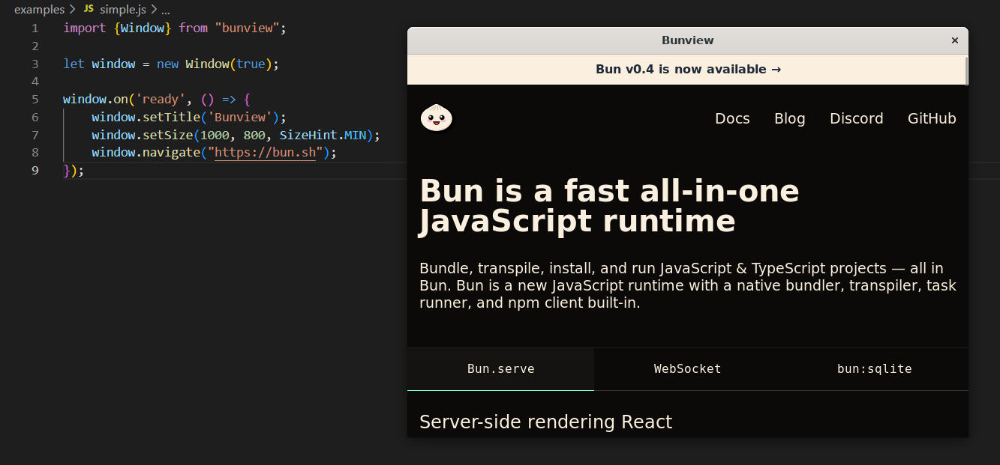

<div align="center">
<br>
<h1>bunview</h1><br>
<i>
Feature-complete <a href="https://github.com/webview/webview">webview</a> bindings for <a href="https://bun.sh">Bun</a>
</i>
<br><br>
<!--
<br><br>
-->
</div>



Bunview is a cross-platform library to build web-based GUIs for desktop applications.

## Installation

```
bun add bunview
```

## Usage

```js
import {Window, SizeHint} from "bunview";

let window = new Window(true);

window.on('ready', () => {
    window.setTitle('Bunview');
    window.navigate("https://bun.sh");
});
```

There is no documentation right now, hence the best place to start is [examples](https://github.com/theseyan/bunview/blob/main/examples).

## Limitations

- Setting `MIN` and `MAX` window size hints on macOS does not work, you must use either `FIXED` or `NONE`
- `Window.init` to inject Javascript preload does not work correctly on macOS

# Building from source
Bunview is written in Zig and compilation is fairly straightforward. The prerequisites are:
- Zig version [0.11.0-dev.944+a193ec432](https://ziglang.org/builds/zig-0.11.0-dev.944+a193ec432.tar.xz)

```bash
# Clone the repository and update submodules
git clone https://github.com/theseyan/bunview && cd bunview
git submodule update --init --recursive

# Build
zig build -Drelease-fast

# Move to build/ folder. Your binary name will differ based on OS/CPU.
mkdir build && mv zig-out/bin/bunview-x86_64-linux ./build/bunview-x86_64-linux

# Run example (must have Bun installed)
bun examples/main.js
```